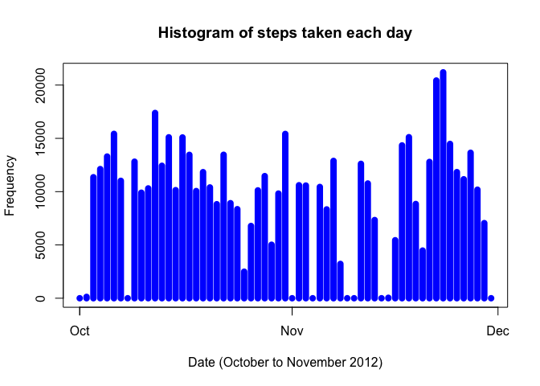
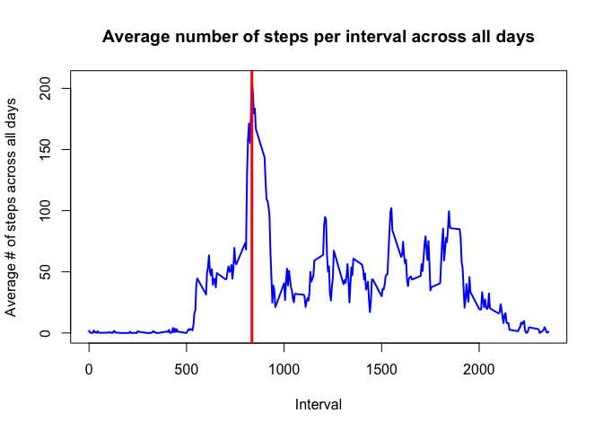
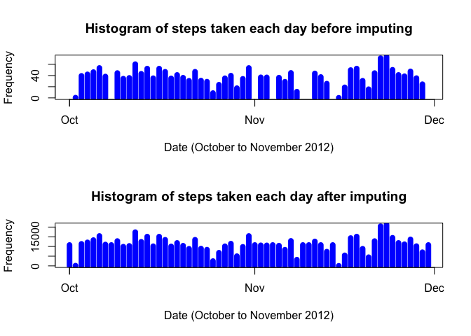
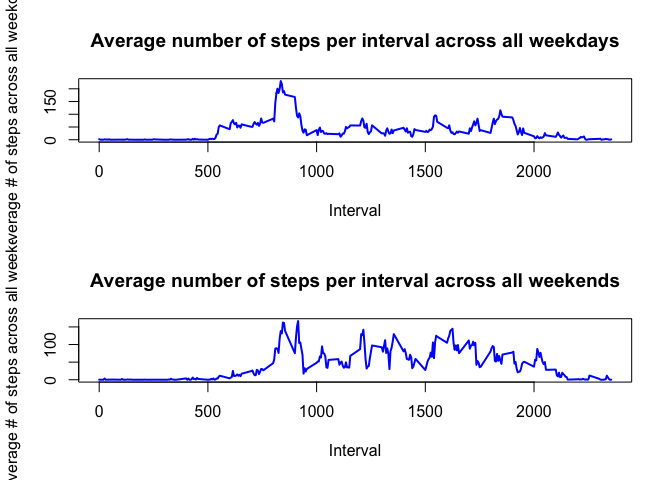

Introduction
============

With the advancement of technology and the growth of the big data
movement, it is now possible to collect a large amount of data about
personal movement using activity monitoring devices. Such examples are:
Fitbit, Nike Fuelband, or Jawbone Up. These kinds of devices are part of
the "quantified self" movement: those who measurements about themselves
on a regular basis in order to improve their health, find patterns in
their behaviour, or because they are simply technology geeks. However,
these data remain severely underused due to the fact that the raw data
are hard to obtain and there is a lack of statistical methods and
software for processing and interpreting the data.

This assignment makes use of data from a personal activity monitoring
device. This device collects data at 5 minute intervals throughout the
day. The data consists of two months of data from an anonymous
individual collected during the months of October and November 2012 and
include the number of steps taken in 5 minute intervals each day.

The overall goal of this assignment is to make some basic exploratory
data analysis to assess some activity patterns with regards to the
anonymous individual's walking patterns. For each day, there are
readings taken at particular 5-minute intervals. These readings
correspond to the number of steps taken by the anonymous individual
between the previous 5-minute interval to the current 5-minute interval.

Data Layout
===========

These intervals are assigned a unique ID which corresponds to the
interval taken at that day. As an example, the ID of 15 means that at
the third observation (i.e. at the 15 minute mark), that is when the
reading was taken for this day. There are 61 days between October and
November, and as such there are 61 observations recorded at the 15
minute mark. Furthermore, there are 61 observations taken at the same
time interval as they were taken each day within these two months. As
such, there are 61 observations for the 20 minute mark, the 30 minute
mark, the 45 minute mark and so on. In addition, for each day, there are
288 intervals / observations were recorded at per day.

As such, the data provided to us is a 3-column data frame:

1.  Column 1 - steps: Indicates the number of steps taken during a
    neighbouring 5-minute interval (between 5 minutes and 10 minutes, 10
    minutes and 15 minutes, etc.). There were some instances where there
    were no readings taken, most likely due to the fact that the subject
    was sleeping or the device was shut off. These are coded in as
    NA values.
2.  Column 2 - date: Indicates the date at which the measurement
    was taken. This is in the YYYY-MM-DD format.
3.  Column 3 - interval: The aforementioned ID that determines at which
    5-minute interval the reading was taken at (5, 10, 15, 20, etc.)

Preamble
--------

There are five steps overall in our analysis:

1.  Loading in and preprocessing the data
2.  Plotting a histogram of the total number of steps taken each day and
    calculating the mean and median of each day.
3.  Determining the average daily activity pattern: Plotting a
    time-series plot for each 5-minute interval (the x-axis) with the
    average number of steps averaged across all days (the y-axis). This
    means that for each 5-minute interval, calculate the average of the
    61 observations taken at each interval. We also calculate the median
    of the 61 observations taken at each interval as well.
4.  Imputing missing values: There were some instances where the amount
    of steps read for an interval were missing. These were coded in as
    NA values. The presence of missing days may introduce bias into some
    calculations or summaries of the data. In this step, a simple
    strategy was performed to replace the missing values in the dataset
    with a filler value. This value was chosen to be the mean within the
    5-minute interval the value was missing for. For example, suppose on
    October 5, 2012, at the 10-minute interval there is missing data.
    This data is filled in by the mean of whatever data was available
    overall (the 61 observations excluding the NA values) for this
    particular interval. The analysis of Step \#2 is repeated with
    similarities and differences being reported.
5.  The last part of the analysis is to split up the data into weekdays
    and weekends and observe if there is any difference in activity
    patterns between these two classes. The same kind of plot is
    repeated like in Step \#3, but now there are two separate plots to
    reflect the activity on the weekdays and weekends.

Loading and Preprocessing Dataset
---------------------------------

Before we begin, it is imperative that the reader set the working
directory to be where this R Markdown file (and subsequently all of the
data for the analysis) is located. This can be done with the setwd()
command.

The first thing we obviously need to do is read in the data and clean it
up so that it is presentable for analysis. Dr. Roger Peng, being the
most generous person on the planet, has already cleaned up the data for
us. However, the only thing that will be done is to convert the dates
into a POSIXlt class for easier processing. The data have been extracted
from .zip archive file and all we need to do is to read the datafile
activity.csv in using read.csv(). After, the dates will be transformed
into the POSIXlt class.

    data <- read.csv("activity.csv")
    head(data)

    ##   steps       date interval
    ## 1    NA 2012-10-01        0
    ## 2    NA 2012-10-01        5
    ## 3    NA 2012-10-01       10
    ## 4    NA 2012-10-01       15
    ## 5    NA 2012-10-01       20
    ## 6    NA 2012-10-01       25

    # Turn the data$date into a POSIXIt class, 
    # allows for easier handling & transformations
    dates_posixit <- strptime(data$date, "%Y-%m-%d")
    data$date <- dates_posixit

    # Record unique values for future processing
    uniqueDates <- unique(dates_posixit)
    uniqueIntervals <- unique(data$interval)

As for uniqueDates and uniqueIntervals, these are variables that store a
list of all possible dates and intervals. These will primarily be used
to help plot our necessary data and for data processing.

What is the mean total number of steps taken per day?
-----------------------------------------------------

First, let's plot a histogram of the total number of steps taken for
each day. Before we do this, let's split up the data into individual
data frames where each data frame represents the data for a particular
day. After this, we will create a vector that accumulates all of the
steps taken for each day and let it get stored into a vector. Each
element in this vector represents the total number of steps taken for a
particular day (61 in total). It should be noted that NA values will be
ignored for the time being. After, we will plot a histogram where the
x-axis represents the particular day in question, while the y-axis
denotes how many steps were taken in total for each day. We will also
calculate what the mean and median number of steps per day were as well.

    steps_split_day <- split(data$steps, dates_posixit$yday)
    steps_split_day_sum <- sapply(steps_split_day, sum, na.rm = TRUE)
    plot(uniqueDates, steps_split_day_sum, main="Histogram of steps taken each day", 
         xlab="Date (October to November 2012)", ylab="Frequency", type="h", lwd=8, col="blue")

The mean and median steps per day are:

    steps_split_day_mean <- sapply(steps_split_day, mean, na.rm = TRUE)
    steps_split_day_median <- sapply(steps_split_day, median, na.rm = TRUE)
    steps_split_day_mean_df <- data.frame(date=uniqueDates,
                                     mean_steps=steps_split_day_mean, row.names=NULL)
    steps_split_day_median_df <- data.frame(date=uniqueDates,
                                     median_steps=steps_split_day_median, row.names=NULL)
    head(steps_split_day_mean_df)

    ##         date mean_steps
    ## 1 2012-10-01        NaN
    ## 2 2012-10-02    0.43750
    ## 3 2012-10-03   39.41667
    ## 4 2012-10-04   42.06944
    ## 5 2012-10-05   46.15972
    ## 6 2012-10-06   53.54167

    head(steps_split_day_median_df)

    ##         date median_steps
    ## 1 2012-10-01           NA
    ## 2 2012-10-02            0
    ## 3 2012-10-03            0
    ## 4 2012-10-04            0
    ## 5 2012-10-05            0
    ## 6 2012-10-06            0

What is the average daily activity pattern?
-------------------------------------------

What we now need to do is split up this data again so that individual
data frames represent the steps taken over each time interval. As such,
there will be a data frame for interval 5, another data frame for
interval 10 and so on. Once we extract out these individual data frames,
we thus compute the mean for each time interval. It is imperative to
note that we again will ignore NA values. We will thus plot the data as
a time-series plot (of type="l"). Once we have done this, we will locate
where in the time-series plot the maximum is located and will draw a red
vertical line to denote this location:

    steps_split_interval <- split(data$steps, data$interval)

    # Find the average amount of steps per time interval - ignore NA values
    steps_split_interval_mean <- sapply(steps_split_interval, mean, na.rm=TRUE)

    # Plot the time-series graph
    plot(uniqueIntervals, steps_split_interval_mean, type="l",
         main="Average number of steps per interval across all days", 
         xlab="Interval", ylab="Average # of steps across all days", 
         lwd=2, col="blue")

    steps_split_interval_max = max(steps_split_interval_mean, na.rm = TRUE)
    steps_split_interval_maxIndex <- as.numeric(which(steps_split_interval_mean
                                                       == steps_split_interval_max))

    maxInterval <- uniqueIntervals[steps_split_interval_maxIndex]
    abline(v=maxInterval, col="red", lwd=3)

Imputing the missing values.
----------------------------

The strategy that we will use to fill in the missing values in the data
set is to replace all NA values with the mean of that particular
5-minute interval the observation falls on. Now that we have devised
this strategy, let's replace all of the NA values with the
aforementioned strategy.

    steps_split_interval_mean[is.nan(steps_split_interval_mean)] <- 0
    steps_split_interval_mean_replicated <- rep(steps_split_interval_mean, 61)
    rawSteps <- data$steps
    stepsNA <- is.na(rawSteps)
    rawSteps[stepsNA] <- steps_split_interval_mean_replicated[stepsNA]
    dataNew <- data
    dataNew$steps <- rawSteps

    steps_split_day_new <- split(dataNew$steps, dates_posixit$yday)
    steps_split_day_new_mean <- sapply(steps_split_day_new, sum)
    par(mfcol=c(2,1))

    # Plot the original histogram first
    plot(uniqueDates, steps_split_day_mean, main="Histogram of steps taken each day before imputing", 
         xlab="Date (October to November 2012)", ylab="Frequency", type="h", lwd=8, col="blue")

    # Plot the modified histogram after
    plot(uniqueDates, steps_split_day_new_mean, main="Histogram of steps taken each day after imputing", 
         xlab="Date (October to November 2012)", ylab="Frequency", type="h", lwd=8, col="blue")

The new mean and median steps per day are:

    steps_split_day_new_mean <- sapply(steps_split_day_new, mean, na.rm = TRUE)
    steps_split_day_new_median <- sapply(steps_split_day_new, median, na.rm = TRUE)
    steps_split_day_new_mean_df <- data.frame(date=uniqueDates,
                                     mean_steps=steps_split_day_new_mean, row.names=NULL)
    steps_split_day_new_median_df <- data.frame(date=uniqueDates,
                                     median_steps=steps_split_day_new_median, row.names=NULL)
    head(steps_split_day_new_mean_df)

    ##         date mean_steps
    ## 1 2012-10-01   37.38260
    ## 2 2012-10-02    0.43750
    ## 3 2012-10-03   39.41667
    ## 4 2012-10-04   42.06944
    ## 5 2012-10-05   46.15972
    ## 6 2012-10-06   53.54167

    head(steps_split_day_new_median_df)

    ##         date median_steps
    ## 1 2012-10-01     34.11321
    ## 2 2012-10-02      0.00000
    ## 3 2012-10-03      0.00000
    ## 4 2012-10-04      0.00000
    ## 5 2012-10-05      0.00000
    ## 6 2012-10-06      0.00000

Are there differences in activity patterns during the weekdays and the weekends ?
=================================================================================

With the new data set we have just created, we are going to split up the
data into two data frames - one data frame consists of all steps taken
on a weekday, while the other data frame consists of all steps taken on
a weekend. The following R code illustrates this for us:

    wdays <- dates_posixit$wday
    type_day <- rep(0, 17568)

    # set the factor 1 for a weekday and 2 for a weekend
    type_day[wdays >= 1 & wdays <= 5] <- 1
    type_day[wdays == 0 | wdays == 6] <- 2

    # create a new factor variable that has labels weekend & weekdays
    day_factor <- factor(type_day, levels=c(1,2), labels=
                        c("Weekdays", "Weekends"))

    dataNew$typeofday <- day_factor

    dataNew_weekdays <- dataNew[dataNew$typeofday == "Weekdays",]
    dataNew_weekends <- dataNew[dataNew$typeofday == "Weekends",]

Now that we have accomplished this, let's split up the data for each
data frame so that we will have two sets of individual data frames. One
set is for weekdays and within this data frame are individual data
frames. Each data frame contains the steps for each interval recorded on
a weekday. The other set is for weekends, and within this data frame are
individual data frames. Like previously, each data frame here contains
the steps for each interval recorded on a weekday. Once we have these
two sets of data frames, we will now calculate the mean amount of steps
for each interval for the weekdays data frame and weekends data frame.
This will result in two vectors - one for the weekdays and the other for
weekends. The following R code does this for us:

    step_split_dataNew_weekdays <- split(dataNew_weekdays$steps, dataNew_weekdays$interval)
    step_split_dataNew_weekends <- split(dataNew_weekends$steps, dataNew_weekends$interval)

    step_split_dataNew_weekdays_mean <- sapply(step_split_dataNew_weekdays, mean)
    step_split_dataNew_weekends_mean <- sapply(step_split_dataNew_weekends, mean)

    par(mfcol=c(2,1))
    plot(uniqueIntervals, step_split_dataNew_weekdays_mean, type="l",
         main="Average number of steps per interval across all weekdays", 
         xlab="Interval", ylab="Average # of steps across all weekdays", 
         lwd=2, col="blue")
    plot(uniqueIntervals, step_split_dataNew_weekends_mean, type="l",
         main="Average number of steps per interval across all weekends", 
         xlab="Interval", ylab="Average # of steps across all weekends", 
         lwd=2, col="blue")

What is interesting about this plot is that it very much sums up the
activity that any normal person would undergo depending on whether it is
a weekday or weekend. For both days, the intervals between 0 and about
525 are uniform. This most likely represents when the subject was
sleeping. The differences start at between 525 and roughly 800. On the
weekdays, movement is most likely attributed to the subject getting
ready to go to work or starting their day. On the weekends, movement is
less frequent. This could be attributed to the subject sleeping in and
perhaps making breakfast to start their day.

There is a huge jump at roughly 830 for the weekdays. This could be
attributed to the subject walking or making their way to work. On the
weekends this behaviour is mimicked as well, perhaps due to making their
way to begin engaging in some extracurricular activities that the
subject is engaged in. Now where it really gets different is at roughly
the 1000 mark. On the weekdays, this could be reflected with the subject
being at work and there is not much movement. A good indication of this
behaviour could be attributed to the fact that the subject has a low
stress job that requires minimal movement. On the weekends, the
behaviour varies wildly. This could be attributed to the extra amount of
movement required to engage in such extracurricular activities.

Where it starts to become similar again is at roughly the 1700 mark.
This could mean that during the weekdays, the subject is getting ready
to head home for the day which is why there is an increased amount of
moment in comparison to the interval between 1000 to 1700. At the same
time with the weekends, there is a relative amount of increased moment
after the 1700 mark but it could reflect that at this time of day, the
subject may be socializing.

All in all, this seems to reflect the behaviour of an individual going
through a normal work day during the weekdays, and having a relaxing
time on the weekends.
